# Malaria Cell Image Classification — Deep Learning Study

A progressive three-model deep learning pipeline for automated
malaria parasite detection from microscopy images.

**Best result: 96.52% accuracy | 97.68% recall on 4,134 test images**

---

## Results Summary

| Model | Accuracy | Precision | Recall | F1-Score | Params |
|-------|----------|-----------|--------|----------|--------|
| Custom CNN (baseline) | 96.52% | 95.46% | 97.68% | 96.56% | 8.4M |
| EfficientNetB3 (transfer learning) | 95.82% | 95.14% | 96.57% | 95.85% | 11.2M |
| Vision Transformer (ViT) | 85.73% | 88.17% | 82.54% | 85.26% | 3.4M |

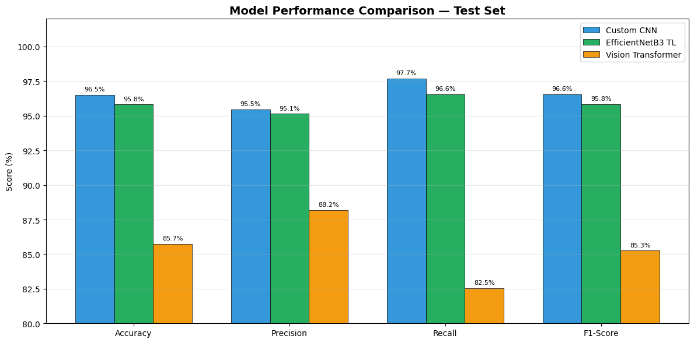

---

## Why This Problem Matters

Malaria kills over 600,000 people annually, predominantly in
sub-Saharan Africa. Manual microscopic diagnosis is time-consuming,
expertise-dependent, and prone to fatigue-related error. This project
builds automated deep learning systems to support diagnosis in
resource-limited settings.

**Clinical framing:** False negatives = untreated patients. Recall is
therefore the most critical metric. The Custom CNN's 97.68% recall
means only 96 of 4,134 test cases were missed.

---

## Dataset

**NIH Malaria Cell Images** — 27,558 microscopy images, 2 classes,
perfectly balanced at 50/50.

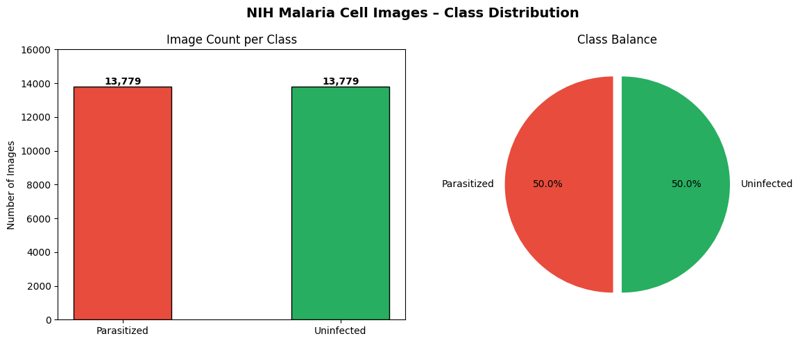

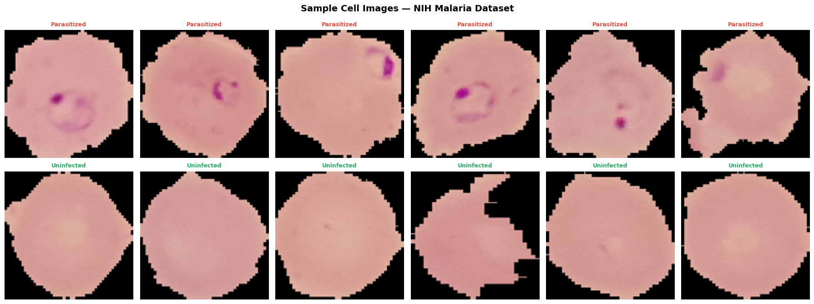

---

## Data Preprocessing

Four-stage pipeline: Resize → Normalise → Stratified Split
(70/15/15) → On-the-fly Augmentation (training only)

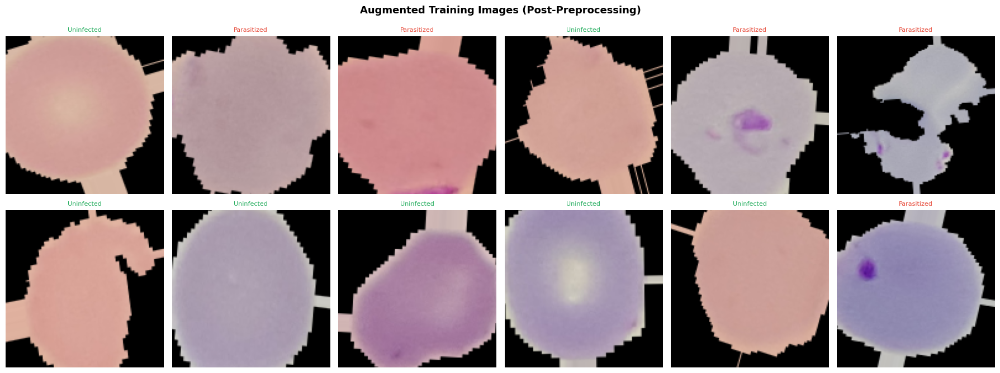

---

## Model Architectures

### Model 1 — Custom CNN (Baseline)
3-block CNN trained from scratch. Filters double each block
(32→64→128). BatchNorm + Dropout regularisation throughout.

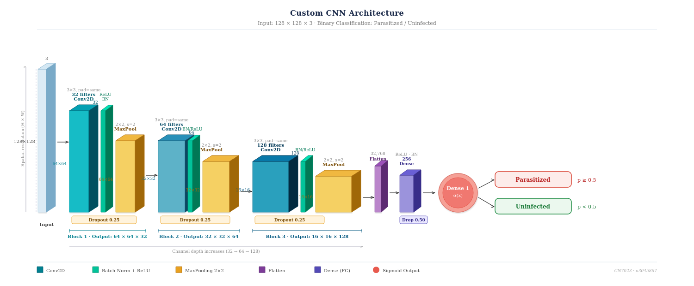

### Model 2 — EfficientNetB3 Transfer Learning
Pre-trained on ImageNet-1K. Two-phase fine-tuning: frozen base
then selective unfreeze of top 30 layers at LR=1e-5.

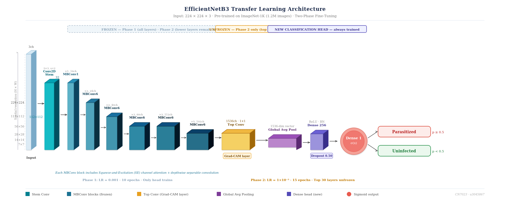

### Model 3 — Vision Transformer (ViT)
Built from scratch. 196 patches of 16×16, 6 transformer encoder
blocks, 8-head self-attention, CLS token classification.

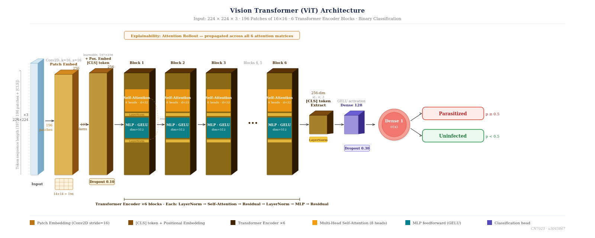

---

## Training History

### Custom CNN
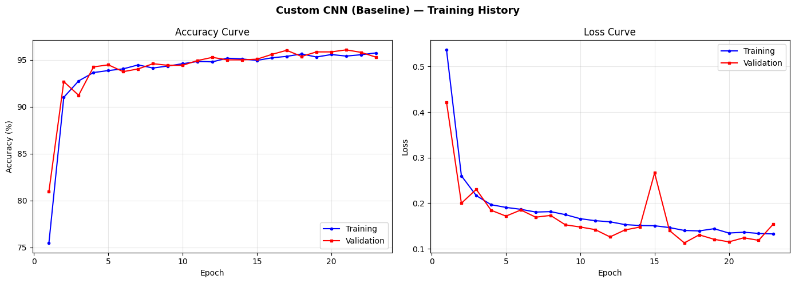

### EfficientNetB3
Dip at epoch 11 = Phase 1 → Phase 2 fine-tuning transition.

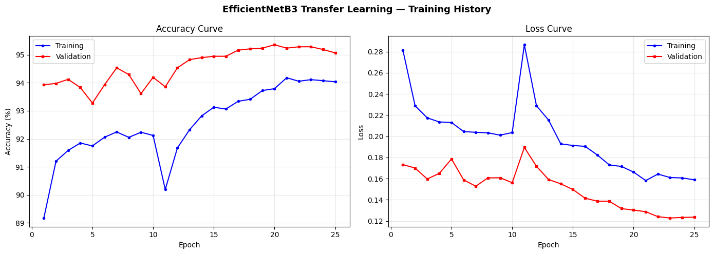

### Vision Transformer
Rapid convergence within 3 epochs due to cosine decay schedule.

---

## Confusion Matrices

### Custom CNN — 96.52% | FN: 96
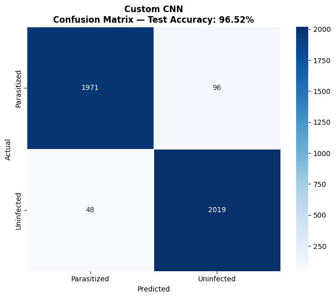

### EfficientNetB3 — 95.82% | FN: 102
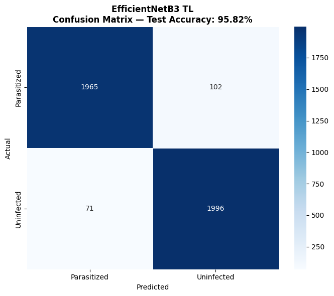

### Vision Transformer — 85.73% | FN: 229
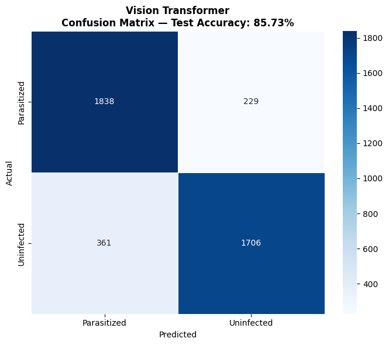

---

## Model Explainability

All three models correctly attend to the purple-stained parasite
region — confirming clinically valid reasoning, not artefact fitting.

### Grad-CAM — Custom CNN
Precisely localises activation to the parasite dot.

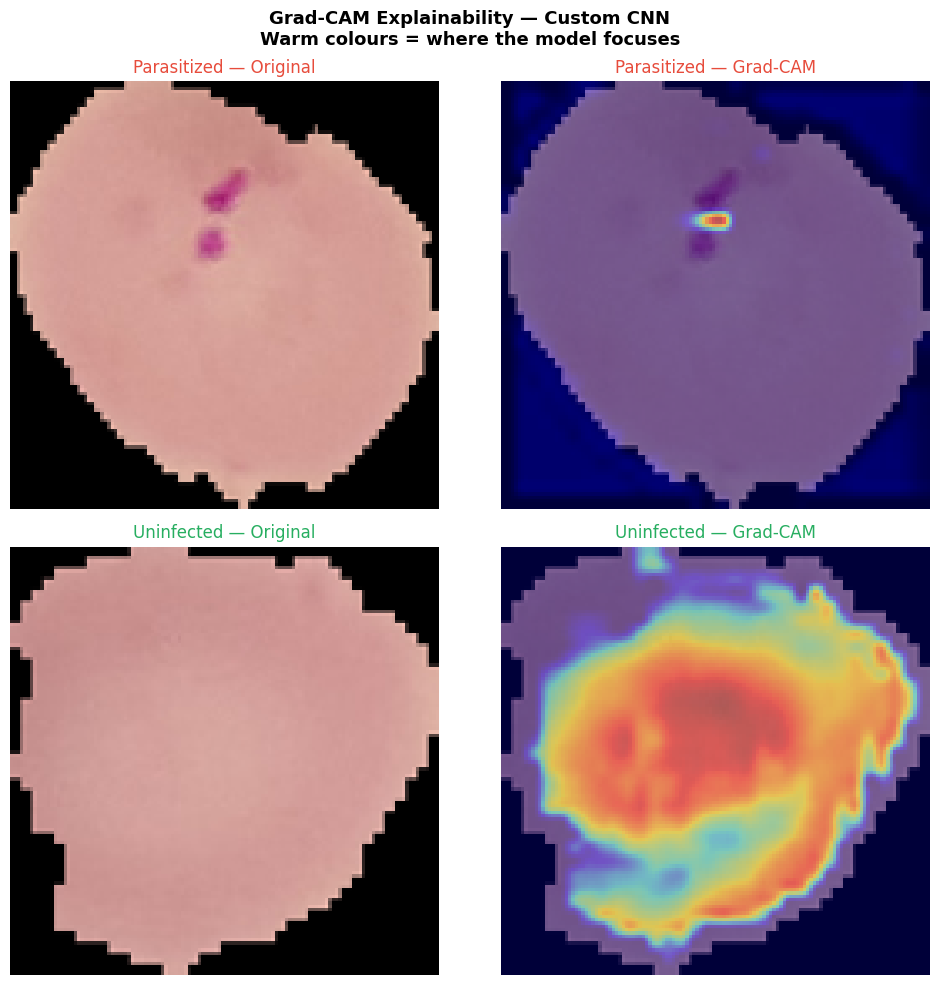

### Grad-CAM — EfficientNetB3
Broader activation zone reflecting wider receptive field.

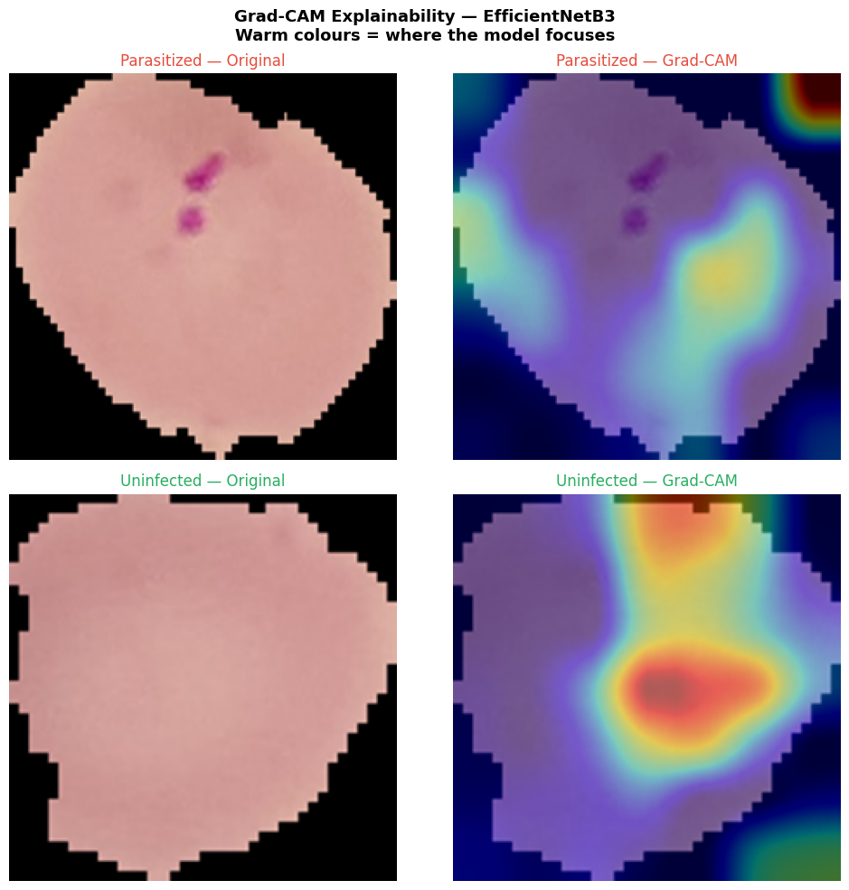

### Attention Rollout — Vision Transformer
CLS token correctly attends to parasite-containing patches.

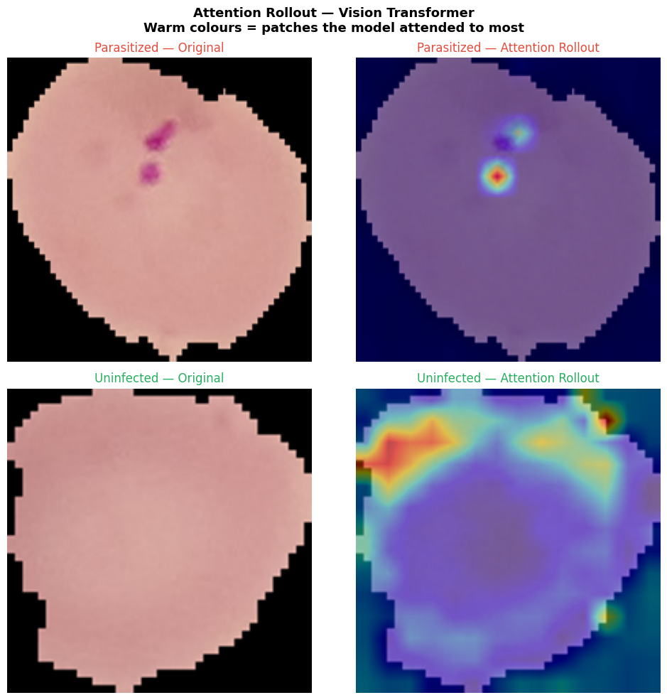

---

## Key Findings

1. **CNN outperformed EfficientNetB3** despite far fewer parameters —
   malaria detection is a localised feature task CNNs are optimised for
2. **Transfer learning offered limited advantage** — ImageNet
   representations don't transfer well to microscopy images
3. **ViT underperformed from scratch** — consistent with Dosovitskiy
   et al. (2021): ViTs need 300M+ images without pre-training
4. **All models are clinically interpretable** — Grad-CAM and
   Attention Rollout confirm correct pathological feature detection

---

## How to Run

1. Go to [Kaggle Notebooks](https://www.kaggle.com/)
2. Create a new notebook
3. Add dataset: `+ Add Data` → search
   `cell-images-for-detecting-malaria` → Add
4. Upload `coursework-malaria-cell-image-classification.ipynb`
5. Settings → Accelerator → **GPU P100**
6. Run All

---

## Stack

Python 3.12 · TensorFlow 2.19 · Keras · NumPy · Matplotlib ·
Seaborn · scikit-learn · Kaggle Notebooks (Tesla P100 GPU)

---

## Project Context

Individual coursework for **CN7023 Artificial Intelligence & Machine
Vision**, MSc Artificial Intelligence and Data Science,
University of East London, 2026.